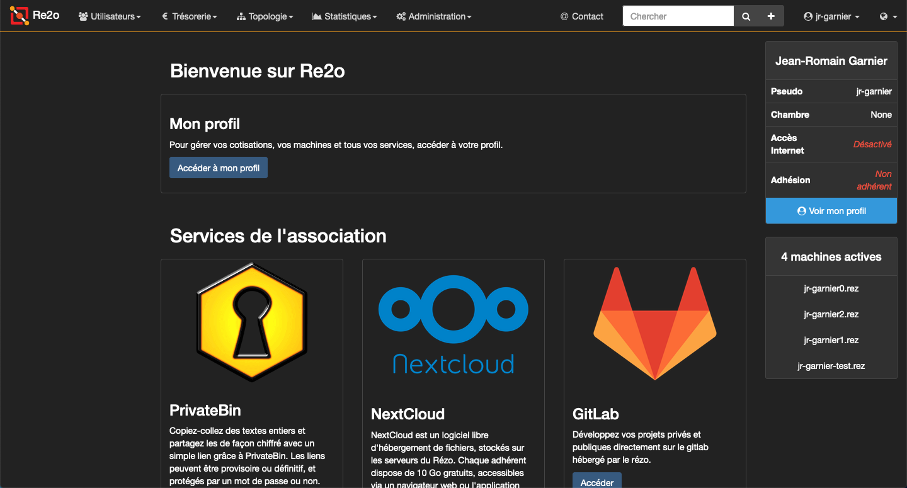
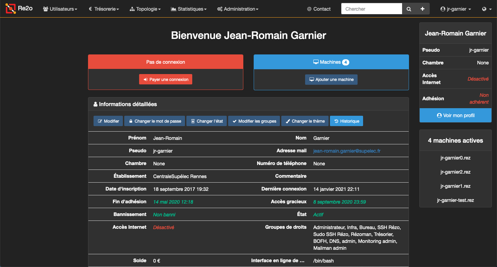
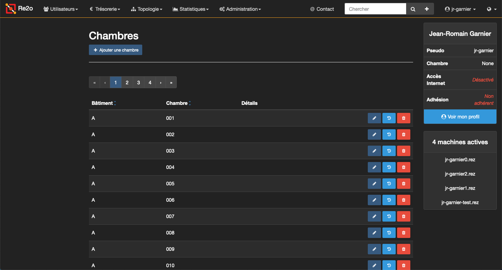
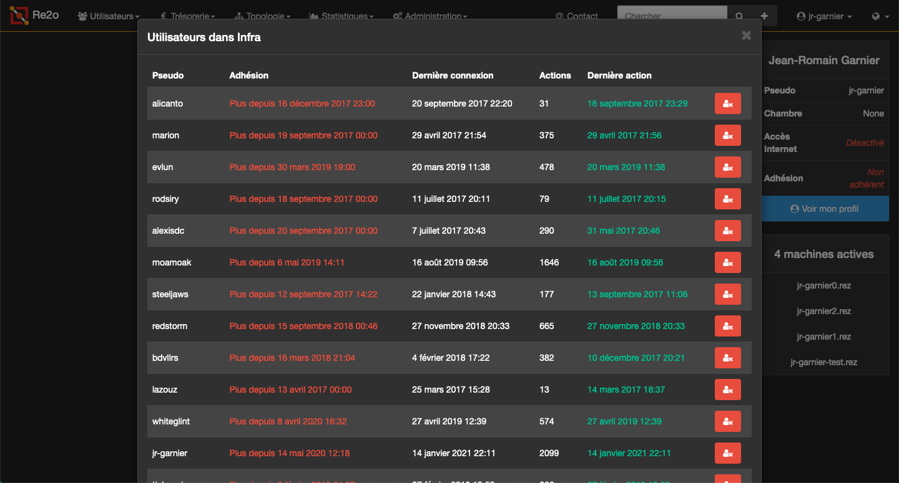

# Default-dark

This theme is inspired by the [Darkly theme for bootstrap](https://bootswatch.com/darkly). However, it is simplified and customized for Re2o.

This theme is supposed to match the default theme as much as possible, but with dark colors: it shouldn't impact padding, margins, behaviors...

## Preview

